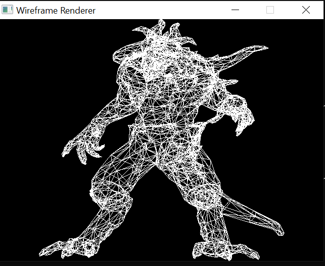
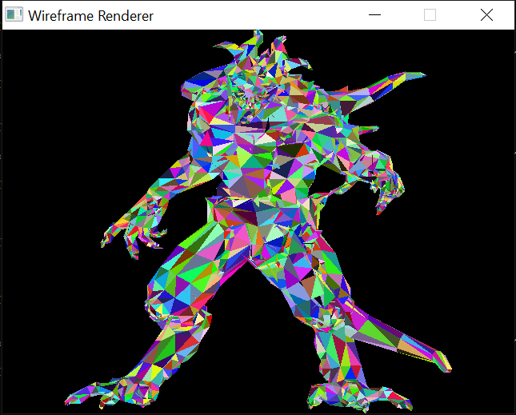
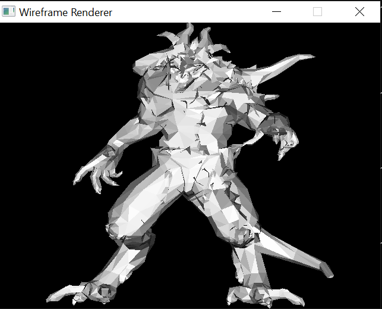

# Wireframe Renderer

Simple waveframe .obj file renderer that supports 90 degree rotation in xyz, triangle rasterization, basic lighting

Uses SDL3 just to render points, all line,triangle,shading is done by me

Loosely following https://haqr.eu/tinyrenderer/

## Up Next
- Removing hidden faces

## Screenshots

Renderings of https://github.com/ssloy/tinyrenderer/tree/master/obj/diablo3_pose

### Wireframe Render

### Triangle Rasterization

### Basic Lighting

